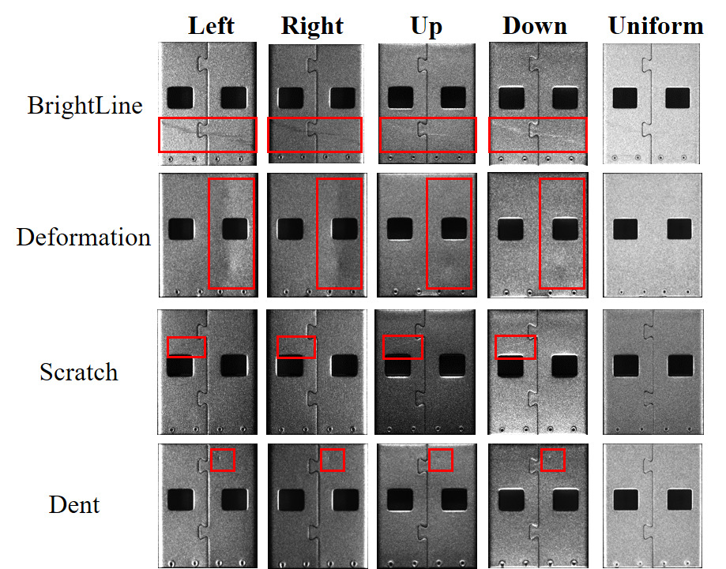
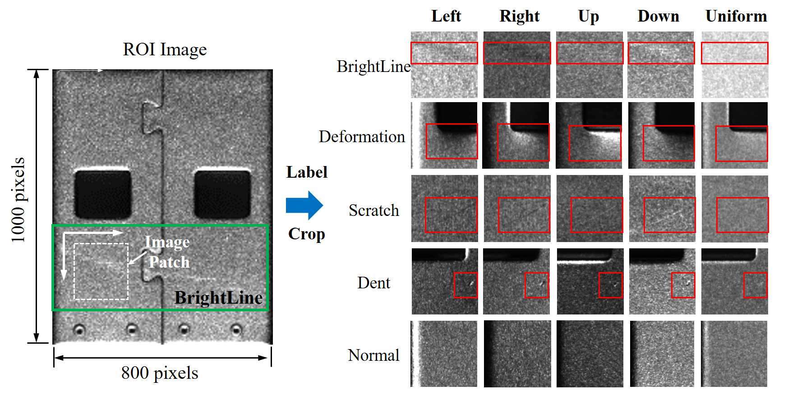

# Fusion-of-multi-light-source-illuminated-images-for-defect-inspection

By  Guizhong Fu, Shukai Jia, Wenbin Zhu, Jiangxin Yang, Yanlong Cao, Michael Ying Yang and Yanpeng Cao.

The paper is available at  |[`[PDF Download]`](https://www.sciencedirect.com/science/article/abs/pii/S088832702200276X)

### Introduction
In this paper, we build a multilight source illumination/acquisition system to capture images of workpieces under individual lighting directions and then propose a multi-stream CNN model to process multi-light source illuminated images for high-accuracy surface defect classification on highly reflective metal.

### Multi-light source illumination Dataset
Dataset |  |[`[Download]`](http://faculty.neu.edu.cn/me/songkc/Vision-based_SIS_Steel.html)

### Contact
If you have any questions, feel free to contact:
- Guizhong Fu (fuguizhongchina@163.com)
